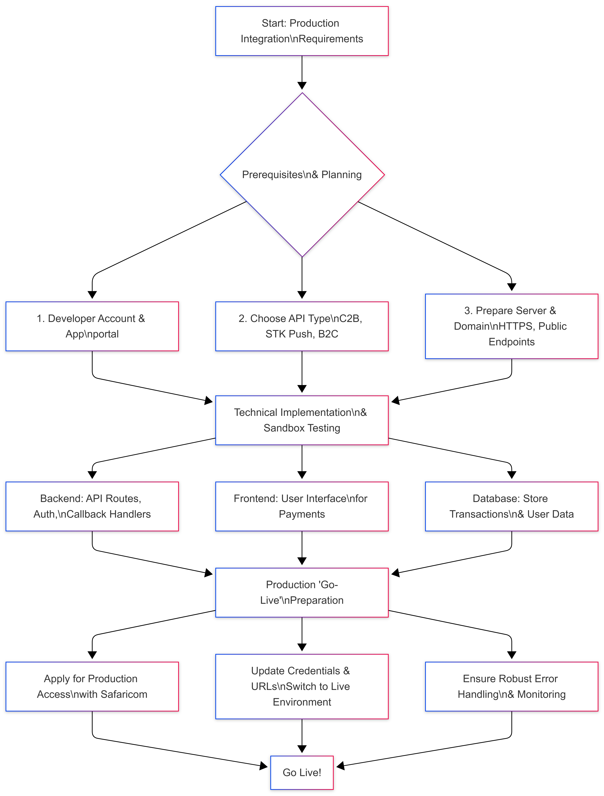

## 📊 Integration Flow

Below is a visual representation of the complete integration process from planning to going live:



✨ Features
🚀 Production Ready - Built for live M-Pesa API integration

💳 STK Push - Seamless Lipa Na M-Pesa Online payments

🔒 Secure - Best practices for credential management and data handling

📊 Database Integration - Complete transaction tracking

📱 Responsive UI - Bootstrap 5 interface that works on all devices

🔄 Real-time Status - Live payment confirmation updates

📝 Comprehensive Logging - Debug and audit trail support

✅ Input Validation - Phone number and amount validation

🛡️ Error Handling - Graceful failure handling and user feedback

📋 Prerequisites
PHP 7.4 or higher

MySQL 5.7 or higher

SSL certificate (HTTPS)

Safaricom Developer Account with production approval

M-Pesa PayBill/Till number

🔧 Installation
Clone the repository:

bash
git clone https://github.com/jonterob/mpesa-production-integration.git
cd mpesa-production-integration
Set up environment variables:

bash
cp .env.example.txt .env
Configure your .env file with production credentials:

env
MPESA_CONSUMER_KEY=your_production_consumer_key
MPESA_CONSUMER_SECRET=your_production_consumer_secret
MPESA_BUSINESS_SHORTCODE=your_paybill_number
MPESA_PASSKEY=your_production_passkey
MPESA_ACCOUNT_REFERENCE=YourCompanyName
Import database schema:

bash
mysql -u your_user -p your_database < database.sql
Configure callback URL in your Safaricom Developer Portal:

text
https://yourdomain.com/mpesa_callback.php
🚦 Usage
Navigate to the payment page:

text
https://yourdomain.com/mpesa_stk.php
Enter Safaricom phone number and amount

Click "Pay Now"

Enter M-Pesa PIN on your phone when prompted

Receive instant confirmation

📁 File Structure
text
├── mpesa_stk.php          # Main payment page and STK handler
├── mpesa_callback.php      # Callback URL processor
├── database.sql           # Database schema
├── .env.example.txt       # Environment variables template
├── .gitignore             # Git ignore rules
├── .htaccess              # Apache security configuration
├── logs/                  # Log directory
│   └── mpesa_callbacks.log # M-Pesa callback logs
└── README.md              # Documentation
🛡️ Security Best Practices
🔐 Never commit .env files to repository

🔒 Always use HTTPS in production

🛡️ Validate and sanitize all user inputs

📊 Monitor logs for suspicious activities

🔑 Rotate API credentials regularly

🚫 Implement rate limiting for endpoints

📊 Database Schema
The database.sql file creates:

transactions - Stores all payment attempts

callback_logs - Logs all M-Pesa callbacks for debugging

🧪 Testing Before Going Live
Test in Safaricom sandbox environment

Verify HTTPS callback URLs

Test various amounts (1 KES to 150,000 KES)

Check database transaction recording

Simulate network failures

Test concurrent payments

✅ Going Live Checklist
Production approval from Safaricom

Valid SSL certificate installed

Production credentials configured

Callback URLs updated to HTTPS

Database properly set up

Logging directories writable

Test with small amounts first

Monitor initial transactions

🤝 Contributing
Contributions are welcome! Please feel free to submit a Pull Request.

Fork the repository

Create your feature branch (git checkout -b feature/AmazingFeature)

Commit your changes (git commit -m 'Add some AmazingFeature')

Push to the branch (git push origin feature/AmazingFeature)

Open a Pull Request

📄 License
This project is licensed under the MIT License - see the LICENSE file for details.

📞 Support
📚 Safaricom Developer Portal

📖 Daraja API Documentation

💬 Community Forum

🐛 Issue Tracker

⭐ Star History
If you find this project useful, please consider giving it a star ⭐ on GitHub!

text

## 📝 **Quick Update Commands**

```bash
# Navigate to your project
cd "F:\Clients\Mpesa payment"

# Replace README content (copy the content above)
notepad README.md

# Save and close, then commit
git add README.md
git commit -m "Update README with proper formatting and integration flowchart"
git push origin main
